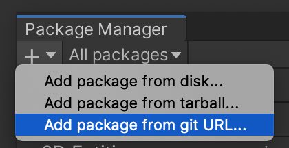

# Blender-like SceneView Hotkeys

[](https://openupm.com/packages/com.nowsprinting.blender-like-sceneview-hotkeys/)
[](https://ikagoya.booth.pm/items/2644683)

This Unity Editor Extensions allows you to select the viewing direction for a SceneView with the [Blender](https://www.blender.org/) -like hotkeys.

e.g. Numpad 1/3/7 as switch front/right/top view.
Numpad 5 as toggle orthographic projection.

Click [日本語](./README_ja.md) for the Japanese page if you need.


## Installation

You can install it in 3 ways.

### By unitypackage

1. Get installer.unitypackage from OpenUPM's package page [📦 Blender-like SceneView Hotkeys - com.nowsprinting.blender-like-sceneview-hotkeys | OpenUPM](https://openupm.com/packages/com.nowsprinting.blender-like-sceneview-hotkeys/)
2. Open your Unity project by Unity Editor, import installer.unitypackage

### By openupm-cli

1. If you installed [openupm-cli](https://github.com/openupm/openupm-cli), run the command below

```bash
openupm add com.nowsprinting.blender-like-sceneview-hotkeys
```

### By Unity Package Manager directly

#### Unity 2019.3 or newer

1. Open Package Manager window (Window | Package Manager)
2. Click `+` on the upper-left of a window, and "Add package from git URL..."



3. Enter the following URL and click "Add"

```
https://github.com/nowsprinting/blender-like-sceneview-hotkeys.git
```

#### Unity 2019.2 or earlier

1. Close Unity Editor
2. Open `Packages/manifest.json` by any Text editor
3. Insert the following line after `"dependencies": {`, and save the file.

```
"com.nowsprinting.blender-like-sceneview-hotkeys": "https://github.com/nowsprinting/blender-like-sceneview-hotkeys.git",
```

4. Reopen Unity project in Unity Editor


## Settings

If your keyboard without a Numpad, open preferences... | Blender-like SceneView Hotkeys, and turn on `Emulate Numpad`.

However, in the Unity Editor, already assigned the `2` key. If you are using Unity 2019 or later, you can change the assignment with Shortcuts Manager.


## Features

Some of Blender's hotkeys Implement.
See [Documentation](./Documentation~/blender-like-sceneview-hotkeys.md) page for implemented hotkeys.

See [Navigating - Blender Manual](https://docs.blender.org/manual/en/latest/editors/3dview/navigate/index.html) for all Blender's hotkeys.


## License

MIT License


## How to contribute

Open an issue or create a pull request.


## Release workflow

Bump version in package.json on default branch.
Or run [Create release pull request](https://github.com/nowsprinting/blender-like-sceneview-hotkeys/actions/workflows/create_release_pr.yml) workflow and merge PR.

Then, Will do the release process automatically by [Release when bump version](.github/workflows/release_when_bump_version.yml) workflow.

Do **not** manually operation the following operations:
- Create release tag
- Publish draft releases